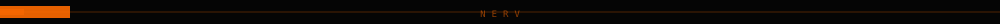

## `UNIT 01 — TIKTOK POLL VOTING`

<!--  -->
<code>[ RECORDING PENDING ]</code>

client-side manipulation of tiktok's poll indicators. 83 stars, 4 forks, a steady stream of dms from people who want more of them.

**[→ repo](https://github.com/fstr415/TikTok-Poll-Voting-Exploit)**

## `UNIT 02 — ANIRIPPER`

<!--  -->
<code>[ RECORDING PENDING ]</code>

windows anime grabber — sub/dub selection, intro skipping, queue downloads. decommissioned, kept for the archive.

**[→ repo](https://github.com/fstr415/AniRipper)**

## `UNIT 03 — FSTR.ONE`

<!--  -->
<code>[ RECORDING PENDING ]</code>

the nerv terminal this profile is wearing the skin of.

**[→ fstr.one](https://fstr.one/)**

<!--  -->

### `PERSONNEL — VISUAL LOG`

<!-- 

 -->

<code>18 · romania · luau for a living · javascript for fun</code>

